---
title: "RNAseq, DE analysis for L_parva killifish osmotic challenge"
author: "Lisa K. Johnson"
date: '2019-02-27'
output:
  html_document:
    code_folding: hide
    collapsed: no
    df_print: paged
    number_sections: yes
    theme: cerulean
    toc: yes
    toc_depth: 5
    toc_float: yes
---


```r
design <- counts_design[counts_design$Ensembl == 'Empty',]
drops <- c("X","Ensembl")
counts<-counts_design[!counts_design$Ensembl == 'Empty',]
rownames(counts)<-counts$Ensembl
design <- design[ , !(names(design) %in% drops)]
counts <- counts[ , !(names(counts) %in% drops)]
design <- design[ , startsWith(names(design),"L_parva")]
counts <- counts[ , startsWith(names(counts),"L_parva")]
dim(design)
```

```
## [1] 5 9
```

```r
dim(counts)
```

```
## [1] 30466     9
```

```r
# design cateogories (full)
species<-as.character(unlist(design[1,]))
nativephysiology<-as.character(unlist(design[2,]))
clade<-as.character(unlist(design[3,]))
condition<-as.character(unlist(design[5,]))
cols<-colnames(counts)
ExpDesign <- data.frame(row.names=cols,
                        condition=condition)
ExpDesign
```

```
##                          condition
## L_parva_BW_1.quant          15_ppt
## L_parva_BW_2.quant          15_ppt
## L_parva_BW_3.quant          15_ppt
## L_parva_FW_1.quant         0.2_ppt
## L_parva_FW_2.quant         0.2_ppt
## L_parva_FW_3.quant         0.2_ppt
## L_parva_transfer_1.quant  transfer
## L_parva_transfer_2.quant  transfer
## L_parva_transfer_3.quant  transfer
```


# Filtering counts

The following shows the dimensions of the dataframe when we filter out genes with low counts.

2 samples must have a count of at least 0.1:


```r
filter <- rownames(counts[rowSums(counts >= 2) >= 0.1,])
filtered_counts <- counts[filter,]
dim(filtered_counts)
```

```
## [1] 21573     9
```


# DESeq


```r
plotDispEsts(dds)
```

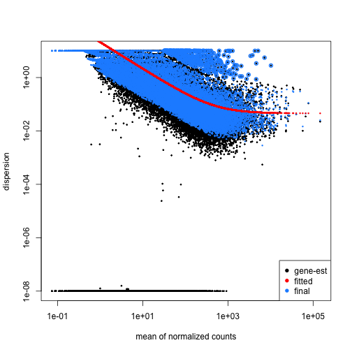

```r
resultsNames(dds)
```

```
## [1] "Intercept"                     "condition_15_ppt_vs_0.2_ppt"  
## [3] "condition_transfer_vs_0.2_ppt"
```

```r
vsd <- vst(dds, blind=FALSE)
meanSdPlot(assay(vsd))
```

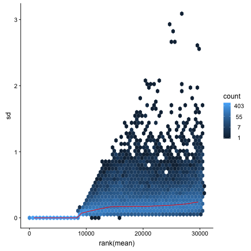


# PCA


```r
plotPCA(vsd, intgroup=c("condition"))
```

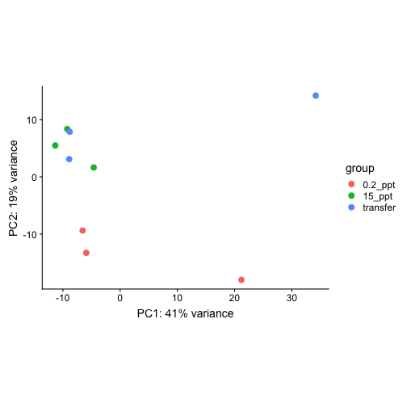

```r
plotPCAWithSampleNames(vsd,intgroup=c("condition"))
```

```
## 
## Attaching package: 'genefilter'
```

```
## The following objects are masked from 'package:matrixStats':
## 
##     rowSds, rowVars
```

```
## Importance of components:
##                            PC1     PC2    PC3     PC4     PC5     PC6
## Standard deviation     16.1489 10.9767 8.1032 6.91375 6.60877 6.08504
## Proportion of Variance  0.4116  0.1902 0.1036 0.07545 0.06894 0.05844
## Cumulative Proportion   0.4116  0.6018 0.7054 0.78088 0.84982 0.90827
##                            PC7     PC8       PC9
## Standard deviation     5.42896 5.35212 1.299e-14
## Proportion of Variance 0.04652 0.04521 0.000e+00
## Cumulative Proportion  0.95479 1.00000 1.000e+00
```

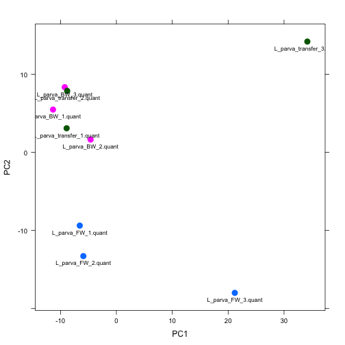


# MA plot, 15_ppt vs. 0.2_ppt

```r
gene_id <- c("avpr2aa","slc24a5","CLDN4","aqp3","cftr","kcnj2a","polyamine-modulated factor 1-like","kcnj1a.6","sept2B","septin-2", "cipcb","clcn2c","zymogen granule membrane protein 16","atp1a1b","solute carrier family 24 member 2")
protein_id <- c("ENSFHEP00000000036","ENSFHEP00000001609","ENSFHEP00000003908","ENSFHEP00000006725","ENSFHEP00000008393","ENSFHEP00000009753","ENSFHEP00000013324",
                "ENSFHEP00000015383","ENSFHEP00000015765","ENSFHEP00000016853","ENSFHEP00000017303","ENSFHEP00000019510","ENSFHEP00000025841",
                "ENSFHEP00000031108","ENSFHEP00000034177")
res<-results(dds,contrast=c("condition","15_ppt","0.2_ppt"))
res_ordered <-as.data.frame(res[order(res$padj),])
res_filtered <-subset(res_ordered,res_ordered$padj<0.05)
id<-rownames(res_filtered)
res_filtered<-cbind(res_filtered,id)
plot(log2(res$baseMean), res$log2FoldChange, 
     col=ifelse(res$padj < 0.05, "red","gray67"),
     main="L_parva (15_ppt vs. 0.2_ppt) (padj<0.05)",xlim=c(1,15),pch=20,cex=1)
abline(h=c(-1,1), col="blue")
resSig = res_ordered[rownames(res_ordered) %in% protein_id, ]
dim(resSig)
```

```
## [1] 15  6
```

```r
genes<-rownames(resSig)
mygenes <- resSig[,]
baseMean_mygenes <- mygenes[,"baseMean"]
log2FoldChange_mygenes <- mygenes[,"log2FoldChange"]
text(log2(baseMean_mygenes),log2FoldChange_mygenes,labels=gene_id,pos=2,cex=0.60)
```

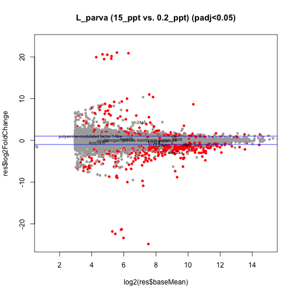


# MA plot, transfer vs. 0.2_ppt

```r
gene_id <- c("avpr2aa","slc24a5","CLDN4","aqp3","cftr","kcnj2a","polyamine-modulated factor 1-like","kcnj1a.6","sept2B","septin-2", "cipcb","clcn2c","zymogen granule membrane protein 16","atp1a1b","solute carrier family 24 member 2")
protein_id <- c("ENSFHEP00000000036","ENSFHEP00000001609","ENSFHEP00000003908","ENSFHEP00000006725","ENSFHEP00000008393","ENSFHEP00000009753","ENSFHEP00000013324",
                "ENSFHEP00000015383","ENSFHEP00000015765","ENSFHEP00000016853","ENSFHEP00000017303","ENSFHEP00000019510","ENSFHEP00000025841",
                "ENSFHEP00000031108","ENSFHEP00000034177")
res<-results(dds,contrast=c("condition","transfer","0.2_ppt"))
res_ordered <-as.data.frame(res[order(res$padj),])
res_filtered <-subset(res_ordered,res_ordered$padj<0.05)
id<-rownames(res_filtered)
res_filtered<-cbind(res_filtered,id)
plot(log2(res$baseMean), res$log2FoldChange, 
     col=ifelse(res$padj < 0.05, "red","gray67"),
     main="L_parva (transfer vs. 0.2_ppt) (padj<0.05)",xlim=c(1,15),pch=20,cex=1)
abline(h=c(-1,1), col="blue")
resSig = res_ordered[rownames(res_ordered) %in% protein_id, ]
dim(resSig)
```

```
## [1] 15  6
```

```r
genes<-rownames(resSig)
mygenes <- resSig[,]
baseMean_mygenes <- mygenes[,"baseMean"]
log2FoldChange_mygenes <- mygenes[,"log2FoldChange"]
text(log2(baseMean_mygenes),log2FoldChange_mygenes,labels=gene_id,pos=2,cex=0.60)
```

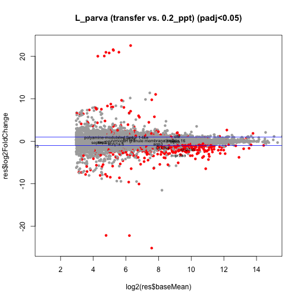


# MA plot, transfer vs. 15_ppt

```r
gene_id <- c("avpr2aa","slc24a5","CLDN4","aqp3","cftr","kcnj2a","polyamine-modulated factor 1-like","kcnj1a.6","sept2B","septin-2", "cipcb","clcn2c","zymogen granule membrane protein 16","atp1a1b","solute carrier family 24 member 2")
protein_id <- c("ENSFHEP00000000036","ENSFHEP00000001609","ENSFHEP00000003908","ENSFHEP00000006725","ENSFHEP00000008393","ENSFHEP00000009753","ENSFHEP00000013324",
                "ENSFHEP00000015383","ENSFHEP00000015765","ENSFHEP00000016853","ENSFHEP00000017303","ENSFHEP00000019510","ENSFHEP00000025841",
                "ENSFHEP00000031108","ENSFHEP00000034177")
res<-results(dds,contrast=c("condition","transfer","15_ppt"))
res_ordered <-as.data.frame(res[order(res$padj),])
res_filtered <-subset(res_ordered,res_ordered$padj<0.05)
id<-rownames(res_filtered)
res_filtered<-cbind(res_filtered,id)
plot(log2(res$baseMean), res$log2FoldChange, 
     col=ifelse(res$padj < 0.05, "red","gray67"),
     main="L_parva (transfer vs. 15_ppt) (padj<0.05)",xlim=c(1,15),pch=20,cex=1)
abline(h=c(-1,1), col="blue")
resSig = res_ordered[rownames(res_ordered) %in% protein_id, ]
dim(resSig)
```

```
## [1] 15  6
```

```r
genes<-rownames(resSig)
mygenes <- resSig[,]
baseMean_mygenes <- mygenes[,"baseMean"]
log2FoldChange_mygenes <- mygenes[,"log2FoldChange"]
text(log2(baseMean_mygenes),log2FoldChange_mygenes,labels=gene_id,pos=2,cex=0.60)
```

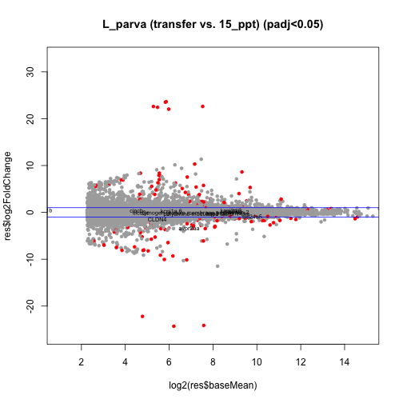

# Salinity-responsive genes of interest

## avpr2aa

```r
tcounts <- t(log2((counts(dds[c("ENSFHEP00000000036"), ], normalized=TRUE, replaced=FALSE)+.5))) %>% 
  merge(colData(dds), ., by="row.names") %>% 
  gather(gene, expression, (ncol(.)-1+1):ncol(.))

C1<-ggplot(tcounts, aes(condition, expression)) +
  geom_point() + 
  stat_summary(fun.y="mean", geom="line") +
  stat_summary(fun.data=mean_sdl, fun.args = list(mult=1), 
               geom="errorbar",width=0.2) +
  theme_bw() +
  theme(legend.position="none",panel.grid.major = element_blank(),
        panel.grid.minor = element_blank(),
        axis.text.x = element_text(angle = 90, hjust = 1)) +
  labs(y="Expression (log2 normalized counts)")+
  ggtitle("avpr2aa")
plot(C1)
```

```
## geom_path: Each group consists of only one observation. Do you need to
## adjust the group aesthetic?
```

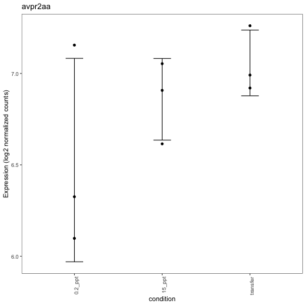


## slc24a5

```r
tcounts <- t(log2((counts(dds[c("ENSFHEP00000001609"), ], normalized=TRUE, replaced=FALSE)+.5))) %>% 
  merge(colData(dds), ., by="row.names") %>% 
  gather(gene, expression, (ncol(.)-1+1):ncol(.))

C1<-ggplot(tcounts, aes(condition, expression)) +
  geom_point() + 
  stat_summary(fun.y="mean", geom="line") +
  stat_summary(fun.data=mean_sdl, fun.args = list(mult=1), 
               geom="errorbar",width=0.2) +
  theme_bw() +
  theme(legend.position="none",panel.grid.major = element_blank(),
        panel.grid.minor = element_blank(),
        axis.text.x = element_text(angle = 90, hjust = 1)) +
  labs(y="Expression (log2 normalized counts)")+
  ggtitle("slc24a5")
plot(C1)
```

```
## geom_path: Each group consists of only one observation. Do you need to
## adjust the group aesthetic?
```

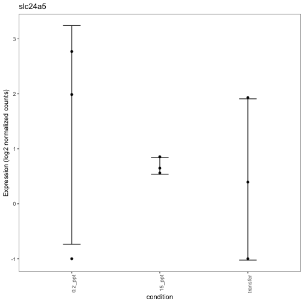


## CLDN4

```r
tcounts <- t(log2((counts(dds[c("ENSFHEP00000003908"), ], normalized=TRUE, replaced=FALSE)+.5))) %>% 
  merge(colData(dds), ., by="row.names") %>% 
  gather(gene, expression, (ncol(.)-1+1):ncol(.))

C1<-ggplot(tcounts, aes(condition, expression)) +
  geom_point() + 
  stat_summary(fun.y="mean", geom="line") +
  stat_summary(fun.data=mean_sdl, fun.args = list(mult=1), 
               geom="errorbar",width=0.2) +
  theme_bw() +
  theme(legend.position="none",panel.grid.major = element_blank(),
        panel.grid.minor = element_blank(),
        axis.text.x = element_text(angle = 90, hjust = 1)) +
  labs(y="Expression (log2 normalized counts)")+
  ggtitle("CLDN4")
plot(C1)
```

```
## geom_path: Each group consists of only one observation. Do you need to
## adjust the group aesthetic?
```

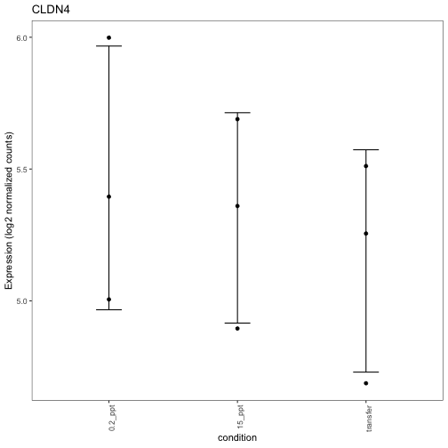


## aqp3

```r
tcounts <- t(log2((counts(dds[c("ENSFHEP00000006725"), ], normalized=TRUE, replaced=FALSE)+.5))) %>% 
  merge(colData(dds), ., by="row.names") %>% 
  gather(gene, expression, (ncol(.)-1+1):ncol(.))

C1<-ggplot(tcounts, aes(condition, expression)) +
  geom_point() + 
  stat_summary(fun.y="mean", geom="line") +
  stat_summary(fun.data=mean_sdl, fun.args = list(mult=1), 
               geom="errorbar",width=0.2) +
  theme_bw() +
  theme(legend.position="none",panel.grid.major = element_blank(),
        panel.grid.minor = element_blank(),
        axis.text.x = element_text(angle = 90, hjust = 1)) +
  labs(y="Expression (log2 normalized counts)")+
  ggtitle("aqp3")
plot(C1)
```

```
## geom_path: Each group consists of only one observation. Do you need to
## adjust the group aesthetic?
```

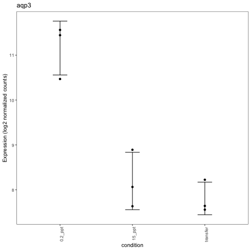


## cftr

```r
tcounts <- t(log2((counts(dds[c("ENSFHEP00000008393"), ], normalized=TRUE, replaced=FALSE)+.5))) %>% 
  merge(colData(dds), ., by="row.names") %>% 
  gather(gene, expression, (ncol(.)-1+1):ncol(.))

C1<-ggplot(tcounts, aes(condition, expression)) +
  geom_point() + 
  stat_summary(fun.y="mean", geom="line") +
  stat_summary(fun.data=mean_sdl, fun.args = list(mult=1), 
               geom="errorbar",width=0.2) +
  theme_bw() +
  theme(legend.position="none",panel.grid.major = element_blank(),
        panel.grid.minor = element_blank(),
        axis.text.x = element_text(angle = 90, hjust = 1)) +
  labs(y="Expression (log2 normalized counts)")+
  ggtitle("cftr")
plot(C1)
```

```
## geom_path: Each group consists of only one observation. Do you need to
## adjust the group aesthetic?
```

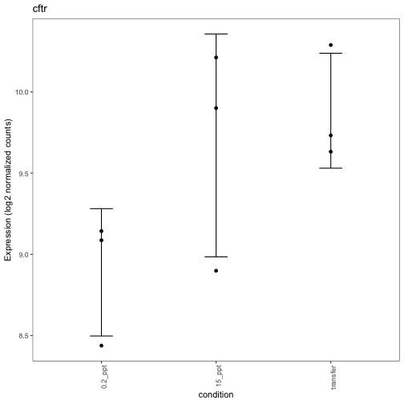


## kcnj2a

```r
tcounts <- t(log2((counts(dds[c("ENSFHEP00000009753"), ], normalized=TRUE, replaced=FALSE)+.5))) %>% 
  merge(colData(dds), ., by="row.names") %>% 
  gather(gene, expression, (ncol(.)-1+1):ncol(.))

C1<-ggplot(tcounts, aes(condition, expression)) +
  geom_point() + 
  stat_summary(fun.y="mean", geom="line") +
  stat_summary(fun.data=mean_sdl, fun.args = list(mult=1), 
               geom="errorbar",width=0.2) +
  theme_bw() +
  theme(legend.position="none",panel.grid.major = element_blank(),
        panel.grid.minor = element_blank(),
        axis.text.x = element_text(angle = 90, hjust = 1)) +
  labs(y="Expression (log2 normalized counts)")+
  ggtitle("kcnj2a")
plot(C1)
```

```
## geom_path: Each group consists of only one observation. Do you need to
## adjust the group aesthetic?
```

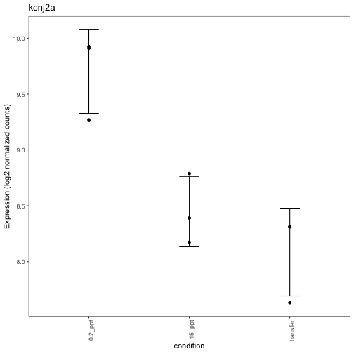


## polyamine-modulated factor 1-like

```r
tcounts <- t(log2((counts(dds[c("ENSFHEP00000013324"), ], normalized=TRUE, replaced=FALSE)+.5))) %>% 
  merge(colData(dds), ., by="row.names") %>% 
  gather(gene, expression, (ncol(.)-1+1):ncol(.))

C1<-ggplot(tcounts, aes(condition, expression)) +
  geom_point() + 
  stat_summary(fun.y="mean", geom="line") +
  stat_summary(fun.data=mean_sdl, fun.args = list(mult=1), 
               geom="errorbar",width=0.2) +
  theme_bw() +
  theme(legend.position="none",panel.grid.major = element_blank(),
        panel.grid.minor = element_blank(),
        axis.text.x = element_text(angle = 90, hjust = 1)) +
  labs(y="Expression (log2 normalized counts)")+
  ggtitle("polyamine-modulated factor 1-like")
plot(C1)
```

```
## geom_path: Each group consists of only one observation. Do you need to
## adjust the group aesthetic?
```

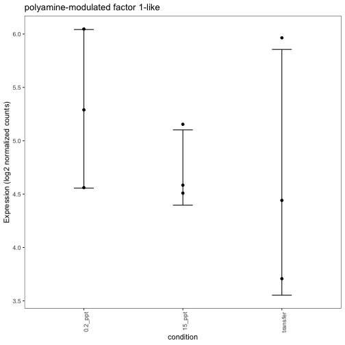


## kcnj1a.6

```r
tcounts <- t(log2((counts(dds[c("ENSFHEP00000015383"), ], normalized=TRUE, replaced=FALSE)+.5))) %>% 
  merge(colData(dds), ., by="row.names") %>% 
  gather(gene, expression, (ncol(.)-1+1):ncol(.))

C1<-ggplot(tcounts, aes(condition, expression)) +
  geom_point() + 
  stat_summary(fun.y="mean", geom="line") +
  stat_summary(fun.data=mean_sdl, fun.args = list(mult=1), 
               geom="errorbar",width=0.2) +
  theme_bw() +
  theme(legend.position="none",panel.grid.major = element_blank(),
        panel.grid.minor = element_blank(),
        axis.text.x = element_text(angle = 90, hjust = 1)) +
  labs(y="Expression (log2 normalized counts)")+
  ggtitle("kcnj1a.6")
plot(C1)
```

```
## geom_path: Each group consists of only one observation. Do you need to
## adjust the group aesthetic?
```

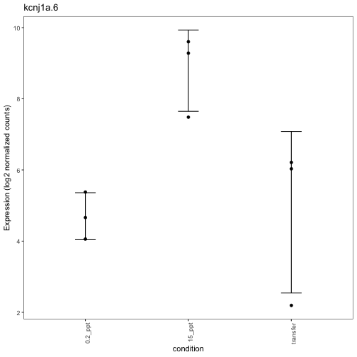


## sept2B

```r
tcounts <- t(log2((counts(dds[c("ENSFHEP00000015765"), ], normalized=TRUE, replaced=FALSE)+.5))) %>% 
  merge(colData(dds), ., by="row.names") %>% 
  gather(gene, expression, (ncol(.)-1+1):ncol(.))

C1<-ggplot(tcounts, aes(condition, expression)) +
  geom_point() + 
  stat_summary(fun.y="mean", geom="line") +
  stat_summary(fun.data=mean_sdl, fun.args = list(mult=1), 
               geom="errorbar",width=0.2) +
  theme_bw() +
  theme(legend.position="none",panel.grid.major = element_blank(),
        panel.grid.minor = element_blank(),
        axis.text.x = element_text(angle = 90, hjust = 1)) +
  labs(y="Expression (log2 normalized counts)")+
  ggtitle("sept2B")
plot(C1)
```

```
## geom_path: Each group consists of only one observation. Do you need to
## adjust the group aesthetic?
```

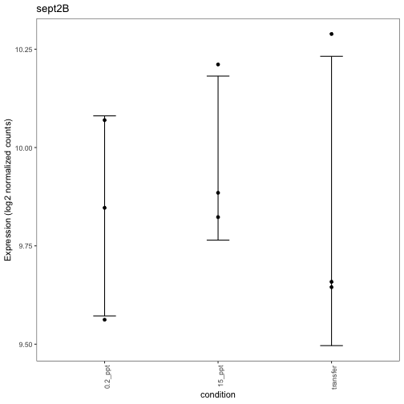


## septin-2

```r
tcounts <- t(log2((counts(dds[c("ENSFHEP00000016853"), ], normalized=TRUE, replaced=FALSE)+.5))) %>% 
  merge(colData(dds), ., by="row.names") %>% 
  gather(gene, expression, (ncol(.)-1+1):ncol(.))

C1<-ggplot(tcounts, aes(condition, expression)) +
  geom_point() + 
  stat_summary(fun.y="mean", geom="line") +
  stat_summary(fun.data=mean_sdl, fun.args = list(mult=1), 
               geom="errorbar",width=0.2) +
  theme_bw() +
  theme(legend.position="none",panel.grid.major = element_blank(),
        panel.grid.minor = element_blank(),
        axis.text.x = element_text(angle = 90, hjust = 1)) +
  labs(y="Expression (log2 normalized counts)")+
  ggtitle("septin-2")
plot(C1)
```

```
## geom_path: Each group consists of only one observation. Do you need to
## adjust the group aesthetic?
```

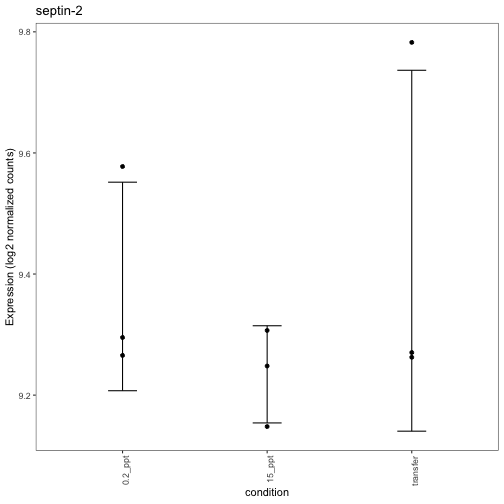


## cipcb

```r
tcounts <- t(log2((counts(dds[c("ENSFHEP00000017303"), ], normalized=TRUE, replaced=FALSE)+.5))) %>% 
  merge(colData(dds), ., by="row.names") %>% 
  gather(gene, expression, (ncol(.)-1+1):ncol(.))

C1<-ggplot(tcounts, aes(condition, expression)) +
  geom_point() + 
  stat_summary(fun.y="mean", geom="line") +
  stat_summary(fun.data=mean_sdl, fun.args = list(mult=1), 
               geom="errorbar",width=0.2) +
  theme_bw() +
  theme(legend.position="none",panel.grid.major = element_blank(),
        panel.grid.minor = element_blank(),
        axis.text.x = element_text(angle = 90, hjust = 1)) +
  labs(y="Expression (log2 normalized counts)")+
  ggtitle("cipcb")
plot(C1)
```

```
## geom_path: Each group consists of only one observation. Do you need to
## adjust the group aesthetic?
```

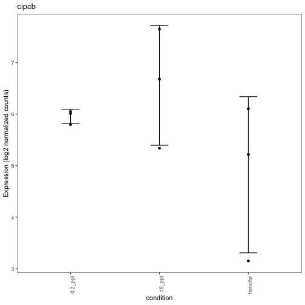


## clcn2c

```r
tcounts <- t(log2((counts(dds[c("ENSFHEP00000019510"), ], normalized=TRUE, replaced=FALSE)+.5))) %>% 
  merge(colData(dds), ., by="row.names") %>% 
  gather(gene, expression, (ncol(.)-1+1):ncol(.))

C1<-ggplot(tcounts, aes(condition, expression)) +
  geom_point() + 
  stat_summary(fun.y="mean", geom="line") +
  stat_summary(fun.data=mean_sdl, fun.args = list(mult=1), 
               geom="errorbar",width=0.2) +
  theme_bw() +
  theme(legend.position="none",panel.grid.major = element_blank(),
        panel.grid.minor = element_blank(),
        axis.text.x = element_text(angle = 90, hjust = 1)) +
  labs(y="Expression (log2 normalized counts)")+
  ggtitle("clcn2c")
plot(C1)
```

```
## geom_path: Each group consists of only one observation. Do you need to
## adjust the group aesthetic?
```

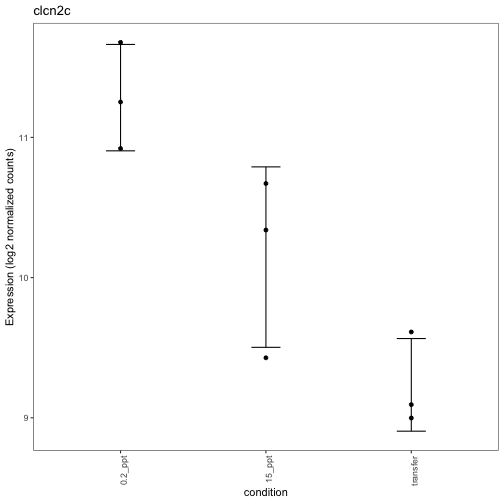


## zymogen granule membrane protein 16

```r
tcounts <- t(log2((counts(dds[c("ENSFHEP00000025841"), ], normalized=TRUE, replaced=FALSE)+.5))) %>% 
  merge(colData(dds), ., by="row.names") %>% 
  gather(gene, expression, (ncol(.)-1+1):ncol(.))

C1<-ggplot(tcounts, aes(condition, expression)) +
  geom_point() + 
  stat_summary(fun.y="mean", geom="line") +
  stat_summary(fun.data=mean_sdl, fun.args = list(mult=1), 
               geom="errorbar",width=0.2) +
  theme_bw() +
  theme(legend.position="none",panel.grid.major = element_blank(),
        panel.grid.minor = element_blank(),
        axis.text.x = element_text(angle = 90, hjust = 1)) +
  labs(y="Expression (log2 normalized counts)")+
  ggtitle("zymogen granule membrane protein 16")
plot(C1)
```

```
## geom_path: Each group consists of only one observation. Do you need to
## adjust the group aesthetic?
```

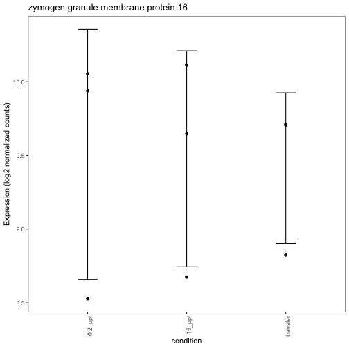


## atp1a1b

```r
tcounts <- t(log2((counts(dds[c("ENSFHEP00000031108"), ], normalized=TRUE, replaced=FALSE)+.5))) %>% 
  merge(colData(dds), ., by="row.names") %>% 
  gather(gene, expression, (ncol(.)-1+1):ncol(.))

C1<-ggplot(tcounts, aes(condition, expression)) +
  geom_point() + 
  stat_summary(fun.y="mean", geom="line") +
  stat_summary(fun.data=mean_sdl, fun.args = list(mult=1), 
               geom="errorbar",width=0.2) +
  theme_bw() +
  theme(legend.position="none",panel.grid.major = element_blank(),
        panel.grid.minor = element_blank(),
        axis.text.x = element_text(angle = 90, hjust = 1)) +
  labs(y="Expression (log2 normalized counts)")+
  ggtitle("atp1a1b")
plot(C1)
```

```
## geom_path: Each group consists of only one observation. Do you need to
## adjust the group aesthetic?
```

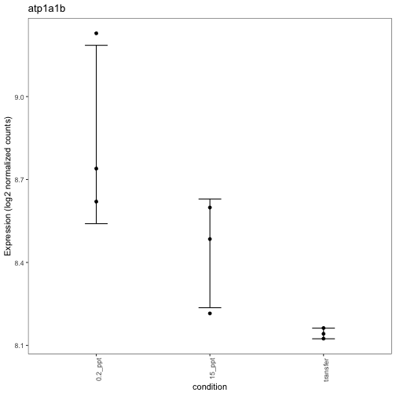


## solute carrier family 24 member 2

```r
tcounts <- t(log2((counts(dds[c("ENSFHEP00000034177"), ], normalized=TRUE, replaced=FALSE)+.5))) %>% 
  merge(colData(dds), ., by="row.names") %>% 
  gather(gene, expression, (ncol(.)-1+1):ncol(.))

C1<-ggplot(tcounts, aes(condition, expression)) +
  geom_point() + 
  stat_summary(fun.y="mean", geom="line") +
  stat_summary(fun.data=mean_sdl, fun.args = list(mult=1), 
               geom="errorbar",width=0.2) +
  theme_bw() +
  theme(legend.position="none",panel.grid.major = element_blank(),
        panel.grid.minor = element_blank(),
        axis.text.x = element_text(angle = 90, hjust = 1)) +
  labs(y="Expression (log2 normalized counts)")+
  ggtitle("solute carrier family 24 member 2")
plot(C1)
```

```
## geom_path: Each group consists of only one observation. Do you need to
## adjust the group aesthetic?
```

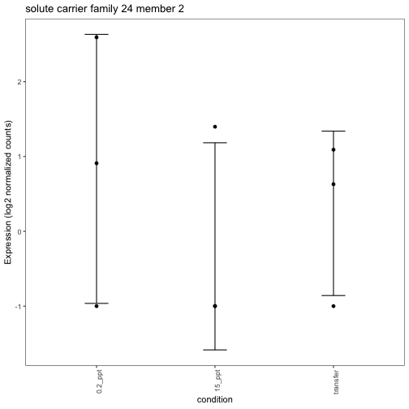


# Get normalized counts and filter out genes with low expression

This is the number of genes in the expression counts table:

```r
# get counts
counts_table = counts(dds, normalized=TRUE)
dim(counts_table)
```

```
## [1] 30466     9
```

After filtering for low expression (where rowSum is greater than or equal to 1):


```r
filtered_norm_counts<-counts_table[!rowSums(counts_table==0)>=1, ]
dim(filtered_norm_counts)
```

```
## [1] 16270     9
```

```r
filtered_norm_counts<-as.data.frame(filtered_norm_counts)
GeneID<-rownames(filtered_norm_counts)
filtered_norm_counts<-cbind(filtered_norm_counts,GeneID)
```


```r
all_goi<-c("ENSFHEP00000007220.1","ENSFHEP00000025841","ENSFHEP00000019510",
           "ENSFHEP00000015383","ENSFHEP00000009753","ENSFHEP00000006725","ENSFHEP00000008393",
           "ENSFHEP00000013324","ENSFHEP00000001609","ENSFHEP00000013324","ENSFHEP00000034177",
           "ENSFHEP00000015765","ENSFHEP00000017303","ENSFHEP00000000036","ENSFHEP00000031108",
           "ENSFHEP00000016853","ENSFHEP00000003908")

ensembl=useMart("ENSEMBL_MART_ENSEMBL")
ensembl = useDataset("fheteroclitus_gene_ensembl",mart=ensembl)
ensembl_proteinID = rownames(counts_table)
query<-getBM(attributes=c('ensembl_peptide_id','ensembl_transcript_id',
'ensembl_gene_id','gene_biotype','external_gene_name',
'description','entrezgene'), filters = 'ensembl_peptide_id', values = ensembl_proteinID, mart=ensembl)
```

```
## Batch submitting query [>-------------------------] 3% eta: 1m Batch
## submitting query [>-------------------------] 5% eta: 46s Batch
## submitting query [=>------------------------] 7% eta: 38s Batch
## submitting query [=>------------------------] 8% eta: 34s Batch
## submitting query [==>-----------------------] 10% eta: 35s Batch
## submitting query [==>-----------------------] 11% eta: 32s Batch
## submitting query [==>-----------------------] 13% eta: 30s Batch
## submitting query [===>----------------------] 15% eta: 31s Batch
## submitting query [===>----------------------] 16% eta: 30s Batch
## submitting query [====>---------------------] 18% eta: 28s Batch
## submitting query [====>---------------------] 20% eta: 31s Batch
## submitting query [=====>--------------------] 21% eta: 29s Batch
## submitting query [=====>--------------------] 23% eta: 28s Batch
## submitting query [=====>--------------------] 25% eta: 26s Batch
## submitting query [======>-------------------] 26% eta: 25s Batch
## submitting query [======>-------------------] 28% eta: 27s Batch
## submitting query [=======>------------------] 30% eta: 26s Batch
## submitting query [=======>------------------] 31% eta: 26s Batch
## submitting query [========>-----------------] 33% eta: 26s Batch
## submitting query [========>-----------------] 34% eta: 25s Batch
## submitting query [========>-----------------] 36% eta: 24s Batch
## submitting query [=========>----------------] 38% eta: 23s Batch
## submitting query [=========>----------------] 39% eta: 22s Batch
## submitting query [==========>---------------] 41% eta: 21s Batch
## submitting query [==========>---------------] 43% eta: 20s Batch
## submitting query [===========>--------------] 44% eta: 19s Batch
## submitting query [===========>--------------] 46% eta: 18s Batch
## submitting query [===========>--------------] 48% eta: 18s Batch
## submitting query [============>-------------] 49% eta: 17s Batch
## submitting query [============>-------------] 51% eta: 16s Batch
## submitting query [=============>------------] 52% eta: 16s Batch
## submitting query [=============>------------] 54% eta: 15s Batch
## submitting query [=============>------------] 56% eta: 14s Batch
## submitting query [==============>-----------] 57% eta: 14s Batch
## submitting query [==============>-----------] 59% eta: 13s Batch
## submitting query [===============>----------] 61% eta: 14s Batch
## submitting query [===============>----------] 62% eta: 13s Batch
## submitting query [================>---------] 64% eta: 12s Batch
## submitting query [================>---------] 66% eta: 12s Batch
## submitting query [================>---------] 67% eta: 11s Batch
## submitting query [=================>--------] 69% eta: 11s Batch
## submitting query [=================>--------] 70% eta: 10s Batch
## submitting query [==================>-------] 72% eta: 10s Batch
## submitting query [==================>-------] 74% eta: 9s Batch
## submitting query [===================>------] 75% eta: 8s Batch
## submitting query [===================>------] 77% eta: 8s Batch
## submitting query [===================>------] 79% eta: 7s Batch
## submitting query [====================>-----] 80% eta: 6s Batch
## submitting query [====================>-----] 82% eta: 6s Batch
## submitting query [=====================>----] 84% eta: 5s Batch
## submitting query [=====================>----] 85% eta: 5s Batch
## submitting query [======================>---] 87% eta: 4s Batch
## submitting query [======================>---] 89% eta: 4s Batch
## submitting query [======================>---] 90% eta: 3s Batch
## submitting query [=======================>--] 92% eta: 3s Batch
## submitting query [=======================>--] 93% eta: 2s Batch
## submitting query [========================>-] 95% eta: 2s Batch
## submitting query [========================>-] 97% eta: 1s Batch submitting
## query [=========================>] 98% eta: 1s Batch submitting query
## [==========================] 100% eta: 0s
```

```r
# link goi Ensembl ID to external_gene_name or description
gene_id <- c("avpr2aa","slc24a5","CLDN4","aqp3","cftr","kcnj2a","polyamine-modulated factor 1-like","kcnj1a.6","sept2B","septin-2", "cipcb","clcn2c","zymogen granule membrane protein 16","atp1a1b","solute carrier family 24 member 2")
protein_id <- c("ENSFHEP00000000036","ENSFHEP00000001609","ENSFHEP00000003908","ENSFHEP00000006725","ENSFHEP00000008393","ENSFHEP00000009753","ENSFHEP00000013324",
                "ENSFHEP00000015383","ENSFHEP00000015765","ENSFHEP00000016853","ENSFHEP00000017303","ENSFHEP00000019510","ENSFHEP00000025841",
                "ENSFHEP00000031108","ENSFHEP00000034177")
```


```r
# -----------------------------
# stats results
# -----------------------------

res_BW_v_FW <- results(dds, tidy=TRUE, contrast=c("condition","15_ppt","0.2_ppt")) %>% arrange(padj) %>% tbl_df() 
res_TR_v_FW <- results(dds, tidy=TRUE, contrast=c("condition","transfer","0.2_ppt")) %>% arrange(padj) %>% tbl_df() 
res_TR_v_BW <- results(dds, tidy=TRUE, contrast=c("condition","transfer","15_ppt")) %>% arrange(padj) %>% tbl_df() 

# -----------------------------
# counts 
# -----------------------------

cols <- colnames(counts_table)
counts_table <- as.data.frame(counts_table[,cols])
dim(counts_table)
```

```
## [1] 30466     9
```

```r
# -----------------------------
# column names for stats from BW_v_FW specific contrast
# -----------------------------

names(res_BW_v_FW)[names(res_BW_v_FW) == 'padj'] <- 'padj-15ppt-v-0.2ppt'
names(res_BW_v_FW)[names(res_BW_v_FW) == 'baseMean'] <- 'baseMean-ALL'
names(res_BW_v_FW)[names(res_BW_v_FW) == 'log2FoldChange'] <- 'log2FoldChange-15ppt-v-0.2ppt'
names(res_BW_v_FW)[names(res_BW_v_FW) == 'lfcSE'] <- 'lfcSE-15ppt-v-0.2ppt'
names(res_BW_v_FW)[names(res_BW_v_FW) == 'stat'] <- 'stat-15ppt-v-0.2ppt'
names(res_BW_v_FW)[names(res_BW_v_FW) == 'pvalue'] <- 'pvalue-15ppt-v-0.2ppt'

# -----------------------------
# column names for stats from TR_v_FW specific contrast
# -----------------------------

names(res_TR_v_FW)[names(res_TR_v_FW) == 'padj'] <- 'padj-TR-v-0.2ppt'
names(res_TR_v_FW)[names(res_TR_v_FW) == 'baseMean'] <- 'baseMean-ALL'
names(res_TR_v_FW)[names(res_TR_v_FW) == 'log2FoldChange'] <- 'log2FoldChange-TR-v-0.2ppt'
names(res_TR_v_FW)[names(res_TR_v_FW) == 'lfcSE'] <- 'lfcSE-TR-v-0.2ppt'
names(res_TR_v_FW)[names(res_TR_v_FW) == 'stat'] <- 'stat-TR-v-0.2ppt'
names(res_TR_v_FW)[names(res_TR_v_FW) == 'pvalue'] <- 'pvalue-TR-v-0.2ppt'

# -----------------------------
# column names for stats from TR_v_BW specific contrast
# -----------------------------

names(res_TR_v_BW)[names(res_TR_v_BW) == 'padj'] <- 'padj-TR-v-15ppt'
names(res_TR_v_BW)[names(res_TR_v_BW) == 'baseMean'] <- 'baseMean-ALL'
names(res_TR_v_BW)[names(res_TR_v_BW) == 'log2FoldChange'] <- 'log2FoldChange-TR-v-15ppt'
names(res_TR_v_BW)[names(res_TR_v_BW) == 'lfcSE'] <- 'lfcSE-TR-v-15ppt'
names(res_TR_v_BW)[names(res_TR_v_BW) == 'stat'] <- 'stat-TR-v-15ppt'
names(res_TR_v_BW)[names(res_TR_v_BW) == 'pvalue'] <- 'pvalue-TR-v-15ppt'

# -----------------------------
# merge counts and stats
# -----------------------------
res_TR_v_FW <- as.data.frame(res_TR_v_FW)
rownames(res_TR_v_FW) <- res_TR_v_FW$row
counts_table_stats <- merge(as.data.frame(res_TR_v_FW),counts_table,by=0)
counts_table_stats <- merge(as.data.frame(res_BW_v_FW),counts_table_stats,by='row')
counts_table_stats <- merge(as.data.frame(res_TR_v_BW),counts_table_stats,by='row')
dim(counts_table_stats)
```

```
## [1] 30466    29
```

```r
# -----------------------------
# merge annotations with stats
# -----------------------------
counts_table_ann <- merge(query,counts_table_stats,by.x = "ensembl_peptide_id", by.y = "row", all = TRUE)
counts_table_ann <- counts_table_ann[!duplicated(counts_table_ann$ensembl_peptide_id), ]
rownames(counts_table_ann) <- counts_table_ann$ensembl_peptide_id
dim(counts_table_ann)
```

```
## [1] 30466    35
```

```r
counts_table_ann <- counts_table_ann[ , -which(names(counts_table_ann) %in% c("Row.names"))]
# -----------------------------
# write csv files
# -----------------------------
counts_table_ann <- counts_table_ann[order(counts_table_ann[,19]), ]
write.csv(counts_table_ann,"/Users/johnsolk/Documents/UCDavis/Whitehead/counts_stats_byspecies/L_parva_stats_annotations_counts.csv")
```

